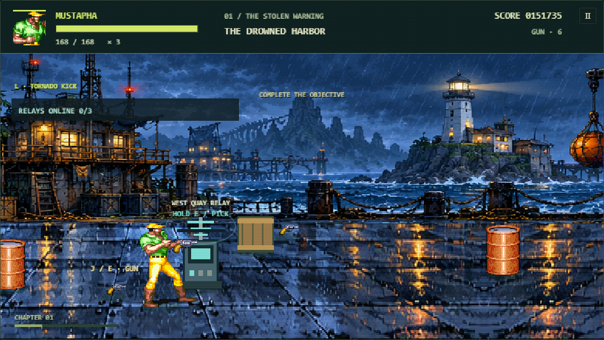

# Cadillacs & Dinosaurs II: Last Eden

An unofficial single-player fan sequel for Mostafa's next adventure. Mustapha, Jack, Hannah and Mess return after the first game's ending for six original chapters and a two-phase final boss.

Three months after the Cadillac brings the four friends home, Marshal Sable steals the coast's flood-warning transmitter and seizes its water supply. Recover the signal, open the evacuation ridge, repair the governor and stop his Crown Engine at the flood barrier. [Read the original sequel script](STORY.md).

## Play or deploy

Open **index.html** or **PLAY GAME.bat**. Keep the whole folder, including `assets/audio`. Offline play requires no installation or emulator.

For **Vercel**, import this repository, choose **Other**, leave build/install commands empty, and use output directory **`.`**. The root `vercel.json` supplies those settings. No environment variables are needed. [DEPLOYMENT.md](DEPLOYMENT.md) also covers GitHub Pages.

## Video-reference and sequel update

- **The four heroes and regular enemy artwork are preserved.** New environments and four human bosses share the arcade palette and perspective. [Art assets and generation prompts](ART-DIRECTION.md).
- **20 required playable objectives**: restore three dock relays, recover three cargo modules, destroy four sonic lures, operate three pressure valves, tune three radio channels, and prepare/release four floodgate controls. Thornmaw retreats when the nest driver is silenced; the final chapter ends after you operate the spillway.
- **Video-informed combat fixes**: grounded firing plants both feet; bullets respect airborne height, nearby obstacles and target order; interrupted bursts retain their unspent ammunition. Flying strikes can connect as they travel, and enemy knockdowns have a separate recovery state. Pause clears held input. [Review and reproduced defects](VIDEO-REVIEW.md).
- **Separate armed animations for all four heroes.** Firearms use recovered aiming/recoil poses and aligned grips. Shooting never triggers a fist strike; picking up a gun cancels queued melee. Point-blank shots work correctly.
- **28 additional hero poses** with distinct running, dash and aerial attacks: Mustapha's flying kick, Jack's slide, Hannah's knee and Mess's body splash. Double-tap running continues while the direction is held.
- A rewritten campaign, new dialogue and ending, a living Thornmaw retreat, and **Sable's mechanical Crown Engine** with hammer, cannon, charge and spillway surge attacks.

- **27 supplied soundtrack tracks**, with changing area themes, boss intros and loops, stage-clear cues, an ending and a Sound Room. Duplicate Four Heroes files are stored once. Tracks load individually as needed.
- **14 weapon types** using the supplied sheet: gun, Uzi, shotgun, rifle, M-16A1, bazooka, knife, rod, stick, club, torch, grenade, dynamite and stone.
- **90 additional recovered combat poses** for armed enemies, heavy fighters, dinosaurs and mutants.
- **Six original environments and six encounters per chapter**, with parallax scenery, rain, ambient particles, varied enemy formations, supplies, foundry vents and pumping-station hazards. Knife fighters throw from range; heavy enemies commit to warned rushes.
- Timed melee impacts, combo knockdowns, double-tap running, dash strikes, aerial attacks and weapon drops on heavy hits. Mustapha is fastest; Hannah deals extra weapon damage.
- Distinct boss attack cycles, warnings and recovery windows. Ordinary dinosaurs calm down and escape when defeated.

## Controls

| Action | Keyboard | Gamepad |
|---|---|---|
| Move / steer | WASD or arrows | Left stick / D-pad |
| Attack / nearby weapon pickup | J, Z or Space | X / left face button |
| Jump / Cadillac boost | K or X | A / bottom face button |
| Special / ram | L or C; also tap attack + jump together | Y / top face button |
| Interact / pick up / throw | E or V | B / right face button |
| Run | Shift or double tap a direction | — |
| Pause | Esc or P | Start |

Touch controls appear on touch devices. Landscape gives a larger playfield. Connect a controller and press a button to activate it.

Hold attack for combos. Jump first, then attack for a flying kick; attack while running for a dash strike. Specials cost eight health **when they hit an enemy** and drop the held weapon. Heavy hits also drop weapons, retaining ammunition.

Pistols, shotguns and rifles carry six rounds; bazookas carry four. Uzis and M-16A1s fire bursts. Shotguns hit a wider lane, rifles penetrate and rockets cause splash damage. **While holding a firearm, J only fires. Empty guns do not switch to melee: use E to throw or swap them.** This deliberate control choice prevents a held fire button turning into punches. Knives stab nearby enemies or are thrown at distant ones. Broken rods become sticks. Grenades and dynamite arc before exploding.

At a marked relay, valve or gate, **hold E / PICK** while standing still. At a radio, tap E until its display matches the marked channel. Attack sonic lures and drive into highway cargo. Both the enemies and the active objective must be cleared to open the next area.

Break containers for supplies; walk over food to heal. Change lanes for charges, volleys and blue spillway-surge markers; jump over shockwaves. Attack during recovery. In the Cadillac, steer into enemies; J bashes, K boosts and L rams. Steer left to reach escorts behind the car.

## Campaign and saving

1. **The Drowned Harbor** — Warden Rook.
2. **The Green Highway** — Iron Convoy.
3. **The Verdant Basin** — Thornmaw.
4. **The Ashen Foundry** — Foreman Cinder.
5. **The Tide Archive** — Signal Captain Echo.
6. **The Crown Barrier** — Marshal Sable and the Crown Engine.

Story gives extra health and gentler damage. Arcade increases enemy health, speed and encounter size. Three lives are followed by unlimited chapter retries. This is a short campaign with one complete ending.

Progress saves at chapter starts and completion in browser local storage. Continue restarts the chapter, not a fight midway through. Cleared chapters unlock for replay. Browser/site origins have separate saves; clearing browser data removes progress.

Audio begins after a click or keypress. SOUND toggles all audio. **Sound Room / Audio Settings** provides independent music/effects switches, music volume and every track. Switching away pauses active play.

## Development

- `game.js`: combat, input, layouts, rendering and boss state machines.
- `campaign.js`, `mission-data.js`: chapter script and required mission tasks.
- `audio.js`, `soundtrack-data.js`, `assets/audio/`: soundtrack and source manifest.
- `assets.js`, `hero-art.js`, `combat-art.js`, `weapon-art.js`, `sequel-art.js`: embedded artwork for local-file loading. `sequel-render.js` draws the new scenery and bosses.
- `assets/original/`: new environment and boss atlases. `assets/reference/`: supplied weapon sheet and retained earlier background references; original-game scenery is no longer loaded in play.
- [STORY.md](STORY.md), [SOURCE-NOTES.md](SOURCE-NOTES.md), [VALIDATION.md](VALIDATION.md): story, provenance and testing.
- `tests/`: optional development tests. No test dependency is required to play or deploy.

There is no production build step. `LAST_EDEN.snapshot` and explicitly named `LAST_EDEN.test` helpers support testing. This follows selected arcade mechanics; it is not a frame-perfect recreation or an official sequel.

## Credits

Original artwork and music: **Capcom, Cadillacs and Dinosaurs (1993)**. Characters and setting: **Mark Schultz's Xenozoic Tales**. Earlier background references retained with credits: **shunninghuang**, via [Sprite Database](https://spritedatabase.net/game/597). Active scenery and human boss designs are original generated assets. Weapon sheet and MP3s were supplied by the user. New fan-game engine, story and encounters were created for this project. Source ROMs and Downloads files remain unchanged.
